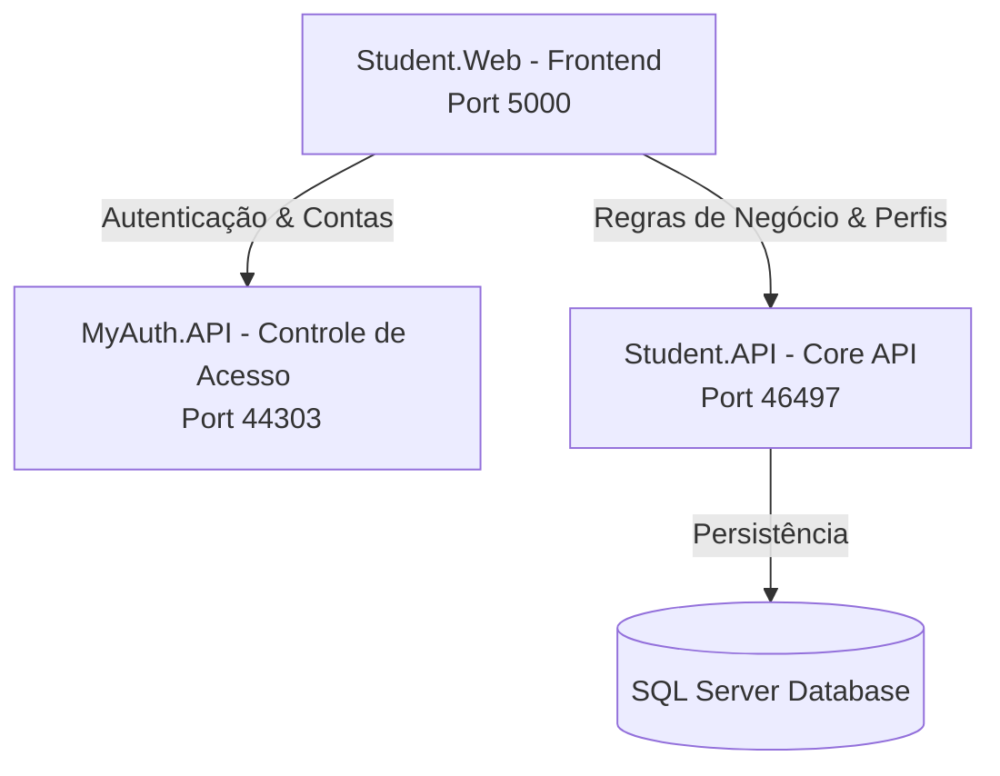

# StudentFreela - Frontend (Student.Web)

Este repositório contém a aplicação frontend **StudentFreela**, uma plataforma web desenvolvida em Blazor Server para conectar os estudantes da instituição de ensino com oportunidades de trabalho e freelancer sob demanda oferecidas por empresas parceiras.

A API correspondente de regras de negócio pode ser encontrada no repositório [API-Pos](https://github.com/MathsPrado/API-Pos).

---

## 🏗️ Arquitetura do Sistema

A aplicação está integrada com a arquitetura geral da plataforma, que conta com três peças-chave em execução paralela:



- **Student.Web (Porta 5000)**: Servidor Blazor com interface moderna e rica. Seus cookies de credenciais (`authToken`) são armazenados e resguardados localmente e gerenciados via in-memory caching pelo `CustomAuthStateProvider`.
- **MyAuth.API (Porta 44303)**: Microsserviço de Identidade que emite tokens JWT seguros.
- **Student.API (Porta 46497)**: Servidor REST Core que faz o mapeamento relacional das classes via EF Core e interage com o banco de dados.

---

## ⚡ Fluxo de Arquitetura da Solução

A plataforma funciona em três camadas integradas:
1. **Identidade e Acesso**: O microsserviço `MyAuth.API` emite tokens JWT. No frontend, o `CustomAuthStateProvider` gerencia dinamicamente esse token por meio do ciclo de vida dos circuitos WebSocket do Blazor Server.
2. **Integração de Cadastro**: O usuário escolhe seu perfil (`Estudante` ou `Empresa`) no cadastro, e as permissões de acesso e navegação são resolvidas automaticamente com base nas claims.
3. **Persistência e Soft Delete**: As solicitações de projetos criadas por empresas são vinculadas automaticamente à ID corporativa logada e utilizam Soft Delete (`DelFlag`). Projetos marcados com `DelFlag = 1` são ocultados do feed de forma lógica no banco de dados.

---

## 💻 Tecnologias Empregadas

- **Blazor Server** (ASP.NET Core no **.NET 10.0**)
- **Estilização Premium**: Custom CSS e HTML5 semântico com grids fluídos e responsivos.
- **Interface e Elementos**: Biblioteca de ícones interativos Bootstrap Icons.
- **Segurança**: Cookie Caching System para segurança de transporte de Token no ciclo de vida de WebSocket Circuits de aplicações Blazor SPA.

---

## 🚀 Instalação e Execução Local

### Pré-requisitos
- Instalar o [.NET 10 SDK](https://dotnet.microsoft.com/download) em sua máquina de build.
- Certificar-se de ter os backends `MyAuth.API` e `Student.API` configurados e em execução.

### Passos para Inicialização
1. Abra o Terminal no diretório raiz do projeto:
   ```bash
   cd Web-Pos
   ```
2. Restaure as dependências do Blazor Server:
   ```bash
   dotnet restore
   ```
3. Construa a aplicação frontend:
   ```bash
   dotnet build
   ```
4. Execute utilizando o launch settings padrão:
   ```bash
   dotnet run --project Student.Web/Student.Web.csproj --launch-profile Student.Web
   ```
   A aplicação Blazor ficará acessível via HTTP em `http://localhost:5000`.
